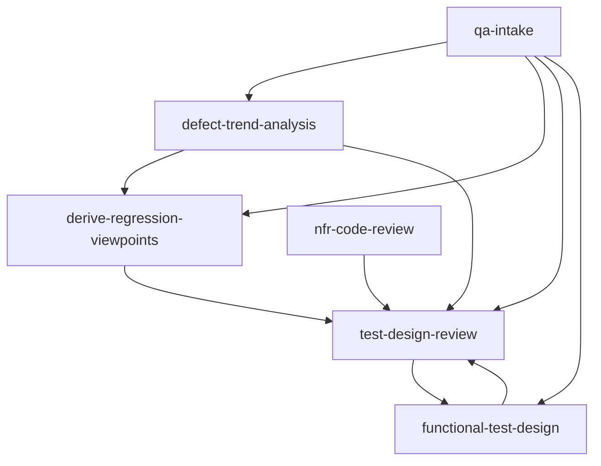

# Skill Candidates

Phase3 output: candidate skills for a personal QA Skillset, extracted from the Phase2 repository review.

## Selection Principle

Start with one coherent workflow:

```text
past defects
  -> defect trend analysis
  -> regression viewpoint derivation
  -> test design review
```

This is narrower than "QA everything", but it creates the strongest feedback loop: past failures become future review criteria.

## MVP Skills

### 1. `defect-trend-analysis`

Purpose:

- Analyze historical defects and test failures.
- Classify recurring defect patterns.
- Separate facts, inferred causes, and hypotheses.
- Produce a reusable defect pattern catalog.

References:

- `proffesor-for-testing/agentic-qe`
  - `qe-defect-intelligence`
  - `qe-root-cause-analyzer`
  - `qe-defect-predictor`
  - evidence classification helper
- `sethdford/claude-skills`
  - defect analysis
  - escaped defect analysis
  - root cause analysis QA
- `fugazi/test-automation-skills-agents`
  - defect lifecycle
  - bug report quality

Inputs:

- Defect CSV/Markdown/table
- Bug tickets
- Test failure logs
- Fix summaries or PR links
- Known modules/features

Outputs:

- `defect-trend-report.md`
- `defect-pattern-catalog.yaml`
- unresolved questions / missing evidence list

Adopt:

- Pattern categories and factors from Agentic QE.
- Evidence type model: direct, inferred, claimed.
- RCA methods: 5 whys, fishbone, change impact.

Modify:

- Replace numeric ML-like `riskScore` with `risk_level: critical | high | medium | low`.
- Keep recommendations practical: review checklist additions, regression viewpoints, data conditions.

Avoid:

- Requiring `aqe` CLI.
- Multi-model routing or visualization.
- Claims without source defect IDs.

### 2. `derive-regression-viewpoints`

Purpose:

- Convert defect patterns into regression test viewpoints.
- Identify horizontal expansion targets.
- Prioritize viewpoints using defect history, business criticality, and change impact.

References:

- `Agile-V/agile_v_skills`
  - regression-selection-agent
  - impact-analysis-agent
  - graph-traceability-agent
- `fugazi/test-automation-skills-agents`
  - qa-manual-istqb regression suite
  - playwright-regression-testing
- `sethdford/claude-skills`
  - regression strategy
  - test coverage analysis

Inputs:

- `defect-pattern-catalog.yaml`
- Existing test cases
- Requirement IDs or feature list
- Recent PRs or changed files

Outputs:

- `regression-viewpoint-catalog.md`
- `selected-regression-viewpoints.yaml`
- `missing-regression-tests.md`

Adopt:

- Agile-V style rationale files.
- Risk + criticality + defect history based selection.
- Trace links from viewpoint to defect IDs.

Modify:

- Use business-feature traceability instead of strict `REQ -> ART -> TC` when formal requirement IDs are unavailable.

Avoid:

- "Run all regression" as the default recommendation.
- Test selection without rationale.

### 3. `test-design-review`

Purpose:

- Review a test design or test case set against risk, requirements, defect history, and test design techniques.
- Detect missing boundary values, state transitions, decision combinations, data integrity checks, and regression viewpoints.

References:

- `bmad-method-test-architecture-enterprise`
  - test-review workflow
  - trace workflow
  - test-design workflow
- `sethdford/claude-skills`
  - functional testing techniques
  - test plan review
- `fugazi/test-automation-skills-agents`
  - qa-manual-istqb static testing and test design references

Inputs:

- Test design document
- Test case table
- Requirements or acceptance criteria
- Defect pattern catalog
- Regression viewpoint catalog

Outputs:

- `test-design-review-report.md`
- finding list with severity and evidence
- missing/over-testing matrix

Adopt:

- BMAD validate/checklist pattern.
- ISTQB design technique checklist.
- Findings prioritized by risk and actionability.

Modify:

- Add domain-specific accounting/application QA checks:
  - period boundary
  - data consistency
  - audit trail
  - re-execution idempotency
  - report/export consistency
  - role/approval separation

Avoid:

- Generic "more tests needed" comments.
- Findings without specific missed condition or missed test objective.

## Next-Wave Skills

### `qa-intake`

Purpose:

- Inspect available inputs and route to the appropriate skill.
- Determine whether the task needs strategy, test design, defect analysis, or review.

Why not MVP:

- Useful as an entrypoint, but only after individual skills have concrete behavior.

### `functional-test-design`

Purpose:

- Generate test conditions and test cases from requirements.
- Use EP/BVA/decision table/state transition/use-case/error guessing internally.

Why not MVP:

- Valuable, but should consume the defect/regression catalog after it exists.

### `nfr-code-review`

Purpose:

- Review code and architecture for non-functional quality.
- Cover performance, reliability, security, maintainability, operability, accessibility, localization, data integrity, auditability.

References:

- `Iron-Ham/claude-deep-review`
- `trailofbits/skills`
- `claude-plugins-official/security-guidance`

Why not MVP:

- Broad surface area and higher risk of generic output. Better as Phase5+ after core QA feedback loop works.

## Candidate Skill Dependency Graph



## Recommended Phase4 Work

Implement only `defect-trend-analysis` first, with:

- one `SKILL.md`
- five step files
- one checklist
- one defect taxonomy reference
- one evidence model reference
- one Markdown report template
- one YAML catalog template
